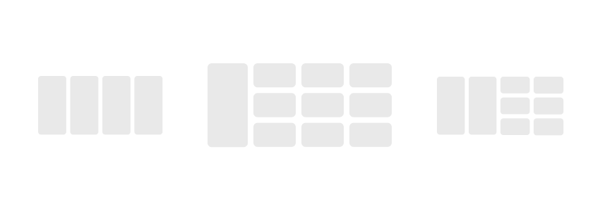

# hensei-web

**hensei-web** is the frontend for [granblue.team](https://app.granblue.team/), an app for saving and sharing teams for [Granblue Fantasy](https://game.granbluefantasy.jp).

## Getting Started

First, you have to set up your environment file. You should start with [.env.sample](https://github.com/jedmund/hensei-web/blob/staging/.env.sample), but here are some gotchas:

#### App URLs

Don't add a trailing slash to these URLs!
The API will run on port 3000 by default, but make sure to change these to match your instance of the API.

```
NEXT_PUBLIC_SIERO_API_URL='http://127.0.0.1:3000/api/v1'
NEXT_PUBLIC_SIERO_OAUTH_URL='http://127.0.0.1:3000/oauth'
```

#### Asset URLs

Next.js serves all assets out of the /public directory. In development we utilize this for all assets, but in production, you will want to host these images on a cloud storage provider like Amazon S3. Once you have that set up and you're running in a production environment, change this to the full bucket URL.

```
NEXT_PUBLIC_SIERO_IMG_URL='/images'
```

#### Dependencies

Once your `.env` is all set up, install all dependencies:

```bash
npm install
# or
yarn install
```

Then, run the development server with:

```bash
npm run dev
# or
yarn dev
```

## Assets

The [hensei-api](https://github.com/jedmund/hensei-api) repository has tasks that will help you get assets, although some were crafted or renamed by hand. The front-end expects this folder structure inside of the `images` folder:

```
root
├─ accessory-grid/
├─ accessory-square/
├─ awakening/
├─ ax/
├─ character-main/
├─ character-grid/
├─ character-square/
├─ guidebooks/
├─ jobs/
├─ job-icons/
├─ job-portraits/
├─ job-skills/
├─ labels/
├─ mastery/
├─ placeholders/
├─ raids/
├─ summon-main/
├─ summon-grid/
├─ summon-square/
├─ updates/
├─ weapon-main/
├─ weapon-grid/
├─ weapon-keys/
├─ weapon-square/
```
